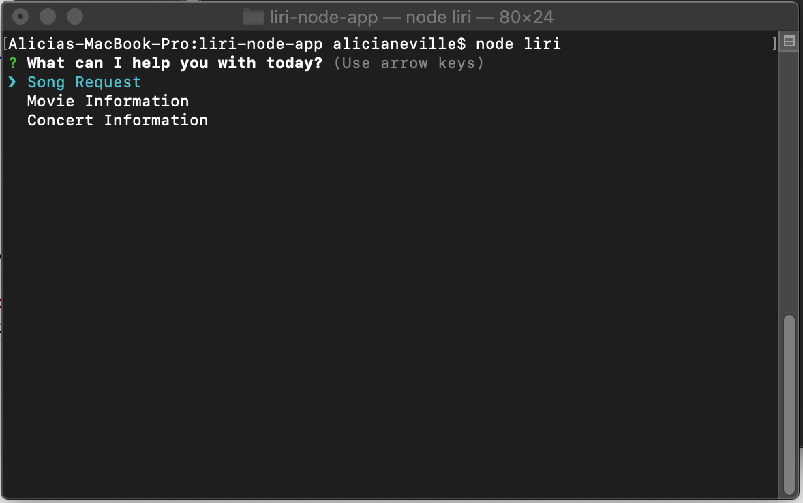
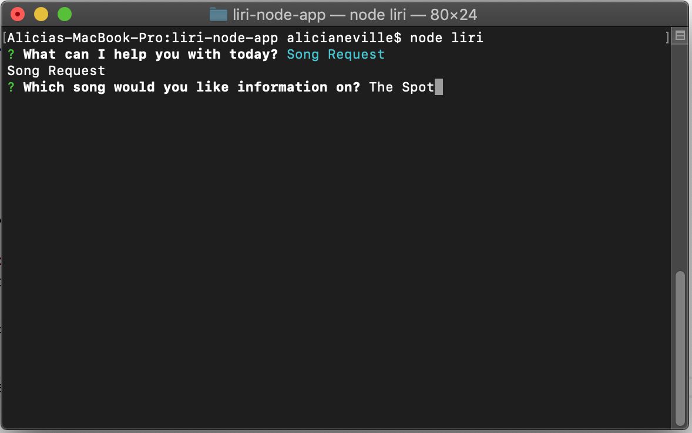
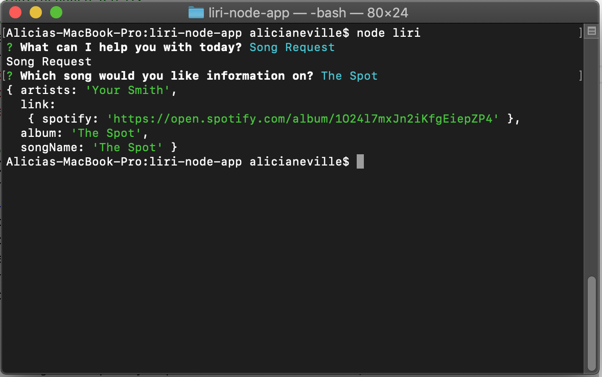
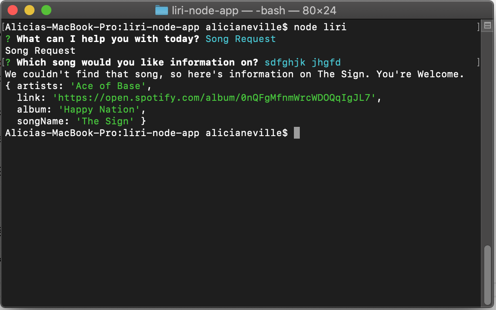
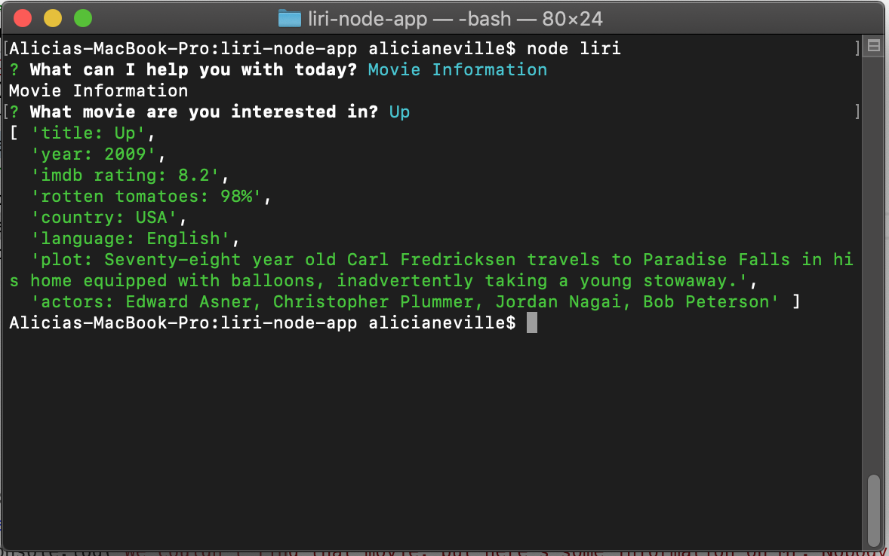
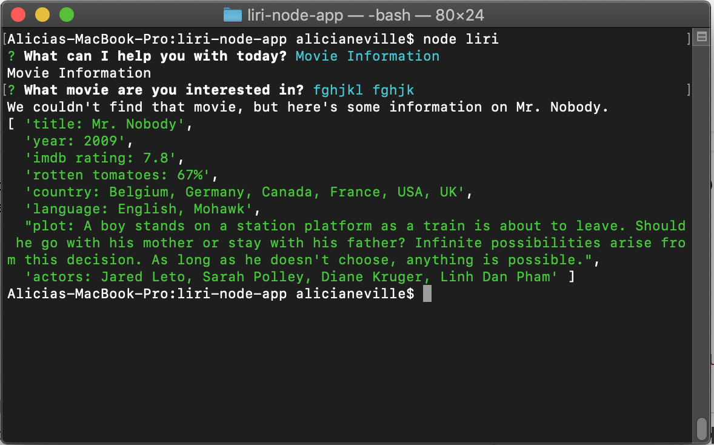
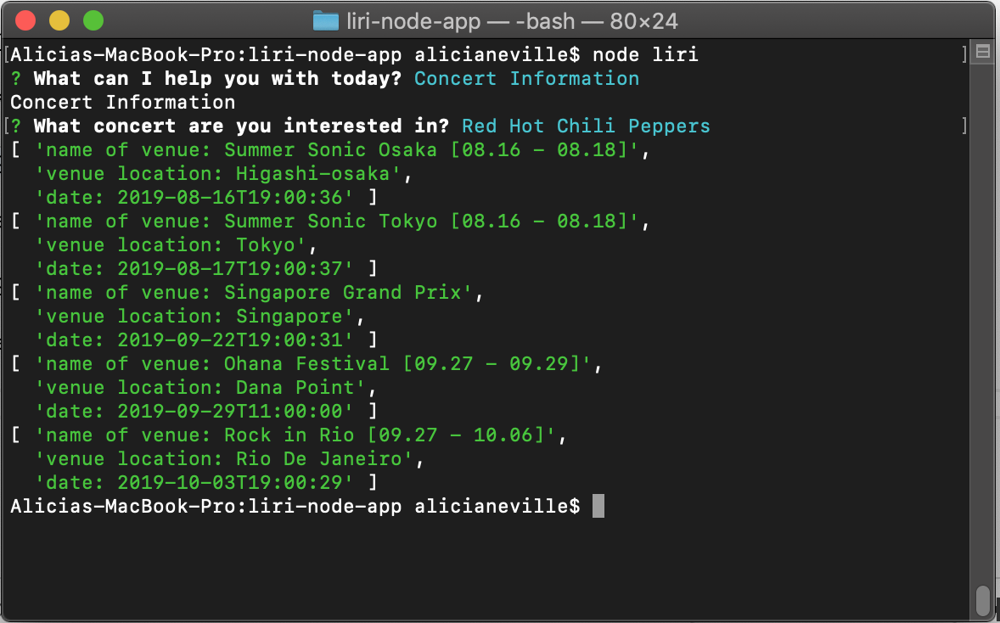

# OVERVIEW
This app displays information based on user inputs for movies, songs, and concerts. The purpose of this app was to strengthen Nodejs skills, JavaScript, and API's.

# TECHNOLOGIES USED
<ul>
<li>JavaScript</li>
<li>Nodejs</li>
<li>BandsInTown API</li>
<li>Spotify API</li>
<li>OMDB API</li>
<li>Node Packages</li>
    <ul>
        <li>Axios</li>
        <li>DOTEMV</li>
        <li>Inquirer</li>
        <li>Moment</li>
        <li>Node-Spotify-api</li>
    </ul>
</ul>

# USE AND SCREENSHOTS:
When then user enters the app, they will be asked "What can I help you with today?" 

When the user selects "Song Request", and puts in the name of a known song

They will see the following information

If the song is unknown, information for the song "The Sign"

If the user instead selects Movie Information, they will see the following information

If the user selects an unknown movie, information for Mr. Nobody will be provided

The user also has the option of selecting a concert. If they do so, they will see

All results are also pushed to a log.txt file. 

## CONTACT INFORMATION
Cell: 251-689-1409 
Email: atamboli4718@gmail.com